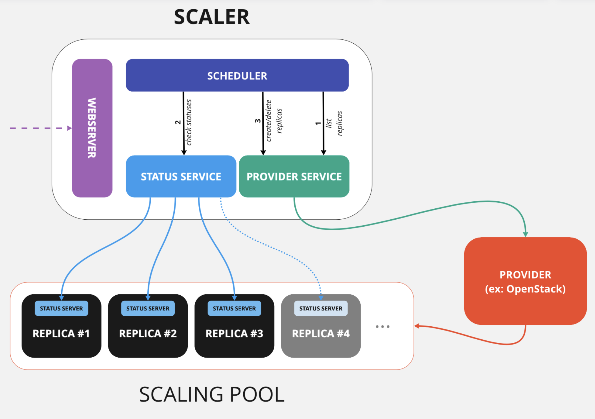
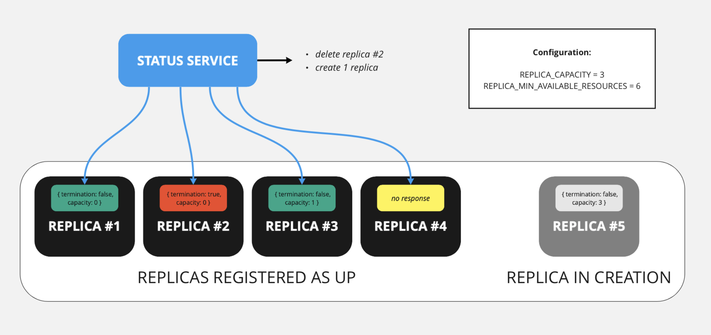
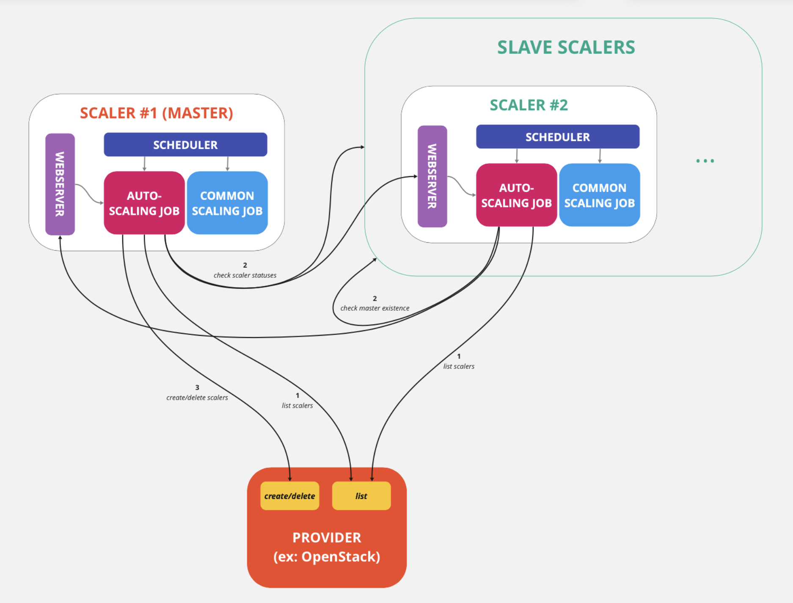
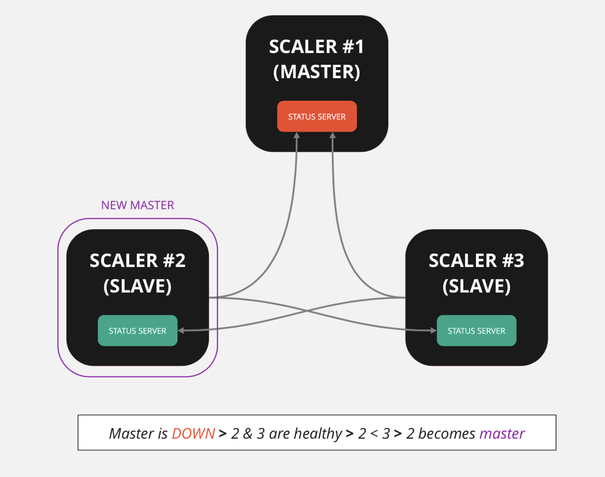

# SimpleScaleVM in-depth

This document aims at bringing some detailed information about the SimpleScaleVM module.

## SimpleScaleVM module in an infrastructure

The role that is played by the scaling module in an infrastructure is detailed in the following schema:

We note that the module is divided in 4 parts:
* the **Provider Service**, that is responsible for all interactions with the Provider.
* the **Status Service**, whose role is to check the status of the replicas.
* the **Scheduler**, that regularly calls the two previous services.
* the **Webserver**, that is independant from the rest of the module and listens on HTTP requests.

Every minute, the module initiates a process in 4 steps that manages the scaling:
* **step 1**: the Provider Service contacts the Provider to list all replicas, and registers the ones that it is supposed to manage.
* **step 2**: the Status Service contacts all replicas that were registered and fetches their status.
* **step 3a**: the Provider Service deletes all registered replicas that are _terminated_ or in _error state_ (according to the provider). Note that it does nothing to replicas whose status is unknown but that are not displayed as errored by the Provider.
* **step 3b**: the Provider Service schedules the creation of a number of replicas in order to have, once those replicas and the others that are still creating are up, the desired number of resources in the scaled pool.

## Resources per replica

The module manages situations where each replica holds a specific number of _resources_ that constitute the scaling cost of replicas. As a matter of fact, the responses that are expected by the Status Service take the form of a JSON dictionary with two entries:
* a **termination** entry, which is a boolean that indicates if the replicas can be destroyed.
* a **capacity** entry, which is an integer that indicates the number of available resources on the replica.

These responses directly impact the creation and deletion commands, as the scaler will ensure that there is no replica that are terminated in the pool, and that the number of available resources in the pool is higher than `REPLICA_MIN_AVAILABLE_RESOURCES`.

As an illustration is worth 1000 words, here is an example of the calculations to create and delete replicas:

In this situation:
* replica #2 has its termination entry set to `true`, so it should be deleted.
* there is not response from replica #4 so it is ignored in the calculations.
* replica #5 is still created so it adds a number of potential resources equal to `REPLICA CAPACITY` (`3` here).

Thus, there are `0 + 1 + 3 = 4` resources potentially available. Yet, `REPLICA_MIN_AVAILABLE_RESOURCES` is set to `6` so the scaler should schedule the creations of `ceil[(6 - 4) / 3] = 1` replica.

## External address management

The module includes a feature that manages the assignment of external addresses to replicas. When this option is enabled, the scaler will manage to always assign a maximum number of external addresses from a specific pool to healthy replicas.

This process is completed inside the scaling iterations of the scheduler. The general functioning of this feature is summarized in the following graphic:

The main application for this feature is **high availability**. With a single (or a few) external address(es) held by the provider, it can be used as a _Keepalived-like_ solution: every time a service that is attached to an external address encounters a problem, it can be replaced with a backup replica that gets back the external address.

## Autoscaling

In order to provide high availability for the Scaler, the module includes a feature that allows to create an auto-managed cluster of SimpleScaleVM instances. The entire process is run inside a secondary job that is planned next to the main job on every instance. It relies on a master/slave paradigm:
* one of the instances is the `master` and manages the creation and deletion of Scaler instances in the cluster.
* all the other instances are `slaves` and verify that there is a healthy master in the cluster.

The general functioning of the feature is summarized in the following graphic:

The mechanism that is used to elect a new master relies on lexicographical order: when a master goes down, each scaler checks if its internal address is the lowest among all healthy replicas to determine if it should become master. The following example illustrates this process:

